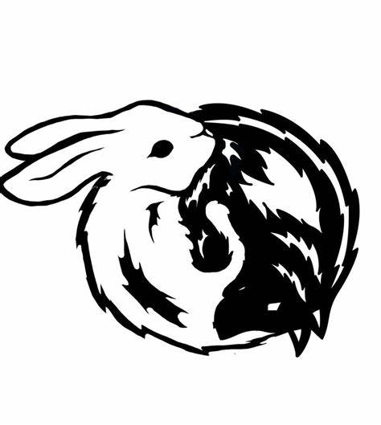

# TuLang

一门基于（臆想）图论的语言。
## 什么是tulang？
tulang的含义为图语言，tu乃图之汉语拼音。此外，tu又可解释为兔（rabbit），lang可解释为狼（wolf）。狼追兔跑，对抗进化，颇得evolutionary computing之妙。
## 为什么是tulang？
造轮子是人的天性，写语言白皮书带来快感，毕竟嘴炮最爽了。
## 介绍一下tulang？
我本是一名编程语言务实派，面对各个语言，适用者用之，不适者学习之，依《五柳先生传》，但求结果正确，不求甚解。然，庭有柿子树，吾读博时所见者，今已亭亭如盖矣，于是脑昏眼花，问题并出：一是编不动熟悉的语言了，二是学不会新语言的新特性了。盖思维模式固化，对于新的思维角度产生抗拒，只能按照已经习惯的方式来思考问题。

进来一直利用碎片时间来思考基于多智能体进化策略的强化学习（MAESRL）。每思之，觉实现之不易。C，类型指针，无所不能，但涉及复杂的数据结构，顿时感觉智商不够。Python，借deep learning之东风，大行其道，然缺乏程序语言应有之质感，学界亦思弃以别攀。Java，虚拟机之强大，令人侧目，轮子众多，苦学不能，论之kotlin，scalar，究竟未得其旨探其秒。Erlang，面向并行，密集运算缺之矣。Matlab，内建矩阵，但非内建函数，效率实在低下。

在MAESRL中，我们需要的是一种易于描述拓扑关系、拓扑与数据分离、易于并行的动态语言。拓扑图，或曰计算图，在deep learning中应用已久，基于图的自动微分技术大获成功，但强化学习需要考虑的问题尤为复杂，解决MAESRL问题，首当其中者，进一步提高拓扑图的表达能力也：允许图的顶点存在更多种类的算符。当然为了避免无关紧要的复杂度，当前回避范畴论中的种种概念为佳。一旦拓扑图的表达能力增强，下一步希望拓扑图拥有更大的动态性：图的高效生长与枝剪。这总动态性允许agent在与环境交互中方便地改变其计算拓扑。

进一步思考，拓扑图可以拥有更广泛的应用空间。为了更好地表述，我们将在TuLang中定义四种基本单元：顶点（vertex），边（edge），权重（weight）与类型（type）。

# 语言描述
## 顶点（vertex）
待写

## 边（edge）
待写

## 权重（weight）
待写

## 类型（type）
待写

